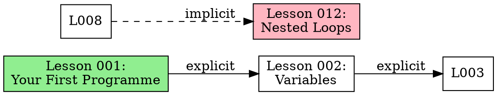
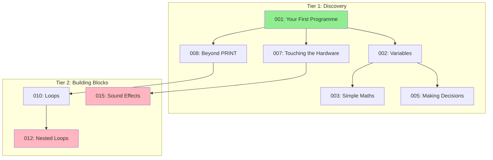

# Lesson Dependency Mapper Agent

**Type**: Agent (Autonomous execution)
**Priority**: P3 (Future)
**Status**: Specification
**Complexity**: High

---

## Purpose

Analyzes all lessons across all platforms to identify prerequisite relationships, builds dependency graph, and visualizes lesson flow. Detects cycles, missing prerequisites, and ordering issues. Useful for curriculum planning, gap identification, and understanding cross-platform concept progression.

---

## When to Use

Use when:
- Planning curriculum expansion (understand concept prerequisites)
- Auditing curriculum flow (detect ordering issues)
- Identifying gaps (missing prerequisite lessons)
- Visualizing cross-platform concept relationships
- Validating tier/phase progression logic

**Do NOT use when:**
- Just checking single lesson (use lesson-validation)
- Only need navigation structure (that's in tier/phase indexes)

---

## Inputs

### Required
- **Scope**: `all` (all platforms), `platform` (single platform), or `phase` (single platform phase)

### Optional
- **Platform**: If scope is `platform` or `phase`
- **Phase**: If scope is `phase`
- **Output format**: `mermaid` (default), `dot` (Graphviz), `json` (data structure)
- **Include implicit**: Whether to detect implicit dependencies (default: true)

---

## What It Does

### Phase 1: Scan Lessons

1. **Discover all lesson files**
   ```bash
   # Find all lesson MDX files
   find /website/src/pages/ -name "lesson-*.mdx" -type f
   ```

2. **Parse each lesson**
   - Extract frontmatter metadata
   - Extract lesson title and description
   - Identify platform, phase, tier, lesson number
   - Extract code samples
   - Note concepts taught

3. **Build lesson inventory**
   ```json
   {
     "c64-phase0-tier1-lesson001": {
       "platform": "commodore-64",
       "phase": 0,
       "tier": 1,
       "lesson": 1,
       "title": "Your First Programme",
       "concepts": ["PRINT", "strings", "RUN"],
       "prerequisites": [],
       "path": "/website/src/pages/commodore-64/phase-0/tier-1/lesson-001.mdx"
     },
     ...
   }
   ```

### Phase 2: Extract Dependencies

#### Explicit Dependencies

**From frontmatter:**
```yaml
---
prerequisites:
  - lesson: 5
    reason: "Uses variables from lesson 5"
  - lesson: 7
    reason: "Extends colour concepts from lesson 7"
---
```

**From content:**
- "As we learned in lesson 5..."
- "Building on lesson 7..."
- "See lesson 3 for basics..."

**Grep patterns:**
```bash
# Find explicit lesson references
grep -E "lesson [0-9]+" lesson-*.mdx
grep -iE "as we learned in|building on|see lesson" lesson-*.mdx
```

#### Implicit Dependencies

**Concept-based inference:**
- If lesson uses variables, depends on lesson that introduces variables
- If lesson uses POKE, depends on lesson that introduces POKE
- If lesson uses loops, depends on lesson that introduces FOR/NEXT

**Complexity-based inference:**
- Later lessons in same tier likely depend on earlier lessons
- Higher tier lessons may depend on lower tier concepts

**Example implicit detection:**
```python
# Lesson 012 uses "FOR I=1 TO 10" but doesn't mention lesson 008
# Lesson 008 introduced FOR/NEXT loops
# Implicit dependency: 012 → 008

if "FOR" in lesson_012_code and "FOR" not in lesson_012_new_concepts:
    for earlier_lesson in lessons_before_012:
        if "FOR" in earlier_lesson.new_concepts:
            add_dependency(lesson_012, earlier_lesson, "implicit-concept")
```

### Phase 3: Build Dependency Graph

1. **Create graph structure**
   ```
   Nodes: Lessons
   Edges: Dependencies (explicit or implicit)
   Edge attributes: type (explicit, implicit-concept, implicit-complexity)
   ```

2. **Detect cycles**
   - Lesson A depends on B, B depends on A (invalid!)
   - Report all cycles as errors

3. **Calculate depth**
   - Lessons with no prerequisites: depth 0
   - Lessons depending only on depth 0: depth 1
   - Continue recursively

4. **Identify orphans**
   - Lessons with no dependencies from other lessons (dead ends)
   - Lessons with no prerequisites but advanced concepts (gaps)

### Phase 4: Generate Visualization

#### Mermaid Format (Default)

```mermaid
graph TD
    L001["Lesson 001: Your First Programme"]
    L002["Lesson 002: Variables"]
    L003["Lesson 003: Simple Maths"]
    L005["Lesson 005: Making Decisions"]
    L008["Lesson 008: Loops"]
    L012["Lesson 012: Nested Loops"]

    L001 --> L002
    L002 --> L003
    L002 --> L005
    L001 --> L008
    L008 --> L012

    style L001 fill:#90EE90
    style L012 fill:#FFB6C1

    classDef explicit stroke:#000,stroke-width:2px
    classDef implicit stroke:#888,stroke-width:1px,stroke-dasharray: 5 5

    linkStyle 0,1,2,3 class:explicit
    linkStyle 4 class:implicit
```

**Legend:**
- Solid arrows: Explicit dependencies
- Dashed arrows: Implicit dependencies
- Green nodes: Entry points (no prerequisites)
- Pink nodes: Terminal lessons (no dependents)

#### DOT Format (Graphviz)



#### JSON Format (Data Structure)

```json
{
  "nodes": [
    {
      "id": "c64-p0-t1-l001",
      "label": "Lesson 001: Your First Programme",
      "platform": "commodore-64",
      "phase": 0,
      "tier": 1,
      "lesson": 1,
      "depth": 0,
      "isEntryPoint": true,
      "isTerminal": false
    },
    ...
  ],
  "edges": [
    {
      "from": "c64-p0-t1-l001",
      "to": "c64-p0-t1-l002",
      "type": "explicit",
      "reason": "Introduces concepts needed for variables"
    },
    ...
  ],
  "cycles": [],
  "orphans": [],
  "stats": {
    "totalLessons": 32,
    "explicitDependencies": 45,
    "implicitDependencies": 12,
    "maxDepth": 5,
    "entryPoints": 3,
    "terminalLessons": 2
  }
}
```

### Phase 5: Generate Report

```markdown
# Lesson Dependency Map

**Generated:** 2025-11-05
**Scope:** All platforms
**Total lessons:** 32

---

## Summary

- **Entry points** (no prerequisites): 3 lessons
  - Lesson 001: Your First Programme
  - Lesson 020: Introduction to Assembly
  - Lesson 025: Hardware Sprites

- **Terminal lessons** (no dependents): 2 lessons
  - Lesson 018: Complete Game
  - Lesson 032: Advanced Optimization

- **Deepest chain:** 5 levels (001 → 002 → 005 → 010 → 015 → 018)

- **Dependencies:**
  - Explicit: 45
  - Implicit (concept-based): 12
  - Implicit (complexity-based): 3

---

## Issues Detected

### Cycles (0)
None detected ✓

### Missing Prerequisites (2)

**Lesson 012: Nested Loops**
- Uses FOR loops but no explicit dependency on lesson 008 (introduces FOR)
- Recommendation: Add explicit prerequisite or reorder lessons

**Lesson 020: Introduction to Assembly**
- Uses concepts from BASIC lessons but no cross-reference
- Recommendation: Add prerequisite note or "Assumes knowledge of..."

### Orphaned Lessons (1)

**Lesson 025: Hardware Sprites**
- No lessons depend on this (dead end)
- Recommendation: Create follow-up lesson using sprites or integrate into game lessons

---

## Visualization

[Mermaid diagram embedded or saved to file]

---

## Cross-Platform Concept Flow

**Universal concepts** (appear on all platforms):
- Variables: C64 L002, NES L003, ZX L002, Amiga L002
- Loops: C64 L008, NES L010, ZX L008, Amiga L007
- Conditionals: C64 L005, NES L006, ZX L005, Amiga L005

**Platform-specific concepts:**
- C64 SID sound: C64 L015 (no equivalents)
- NES PPU scrolling: NES L020 (no equivalents)
- ZX BEEP: ZX L014 (C64/NES use sound chips)

---

## Recommendations

1. Add explicit prerequisites to lessons 012, 020 (missing dependencies)
2. Create follow-up for lesson 025 (orphaned)
3. Consider reordering lessons 010-015 (tight coupling)
4. Add cross-platform concept map to curriculum docs

---
```

---

## Decisions It Makes

### Dependency Detection
- Which references constitute dependencies
- When to infer implicit dependencies
- How to weight explicit vs implicit

### Graph Structure
- Node grouping (by platform, phase, tier)
- Edge styling (explicit vs implicit)
- Layout algorithm (for visualization)

### Issue Classification
- What constitutes a "cycle" (strict or allow weak cycles)
- What constitutes "missing prerequisite" (threshold)
- What constitutes "orphaned" (no dependents or no prerequisites)

### Report Generation
- Which issues to highlight
- Severity classification
- Recommendations for fixes

---

## User Involvement

**User provides:**
1. Scope selection (all platforms, single platform, single phase)
2. Output format preference
3. Review of detected issues

**User reviews:**
- Dependency graph visualization
- Issue report (cycles, missing prerequisites, orphans)
- Recommendations for curriculum adjustments

**User decides:**
- Which issues to fix
- Whether to add explicit prerequisites
- Whether to reorder lessons

---

## Dependency Detection Algorithms

### Explicit Detection

**Pattern matching:**
```python
import re

def extract_explicit_dependencies(lesson_mdx: str) -> list:
    deps = []

    # Pattern 1: "lesson NNN" references
    for match in re.finditer(r'\blesson (\d+)\b', lesson_mdx, re.IGNORECASE):
        deps.append({
            'lesson': int(match.group(1)),
            'type': 'explicit-reference'
        })

    # Pattern 2: Frontmatter prerequisites
    if 'prerequisites:' in lesson_mdx:
        # Parse YAML frontmatter
        prereqs = parse_yaml_prerequisites(lesson_mdx)
        deps.extend(prereqs)

    return deps
```

### Implicit Detection (Concept-Based)

**Concept tracking:**
```python
def detect_concept_dependencies(lesson: Lesson, all_lessons: list) -> list:
    deps = []

    # Extract concepts used in this lesson
    used_concepts = extract_concepts_from_code(lesson.code_samples)

    # Find which earlier lessons introduced these concepts
    for concept in used_concepts:
        if concept not in lesson.new_concepts:  # Lesson doesn't introduce it
            for earlier in all_lessons:
                if earlier.lesson_number < lesson.lesson_number:
                    if concept in earlier.new_concepts:
                        deps.append({
                            'lesson': earlier.lesson_number,
                            'type': 'implicit-concept',
                            'concept': concept
                        })
                        break  # Found introducer

    return deps
```

**Concept dictionary:**
```python
CONCEPTS = {
    'PRINT': ['lesson introduces PRINT statement'],
    'FOR': ['lesson introduces FOR/NEXT loops'],
    'IF': ['lesson introduces IF/THEN conditionals'],
    'POKE': ['lesson introduces POKE for hardware access'],
    'variables': ['lesson introduces variables (LET)'],
    ...
}
```

### Implicit Detection (Complexity-Based)

**Heuristics:**
```python
def detect_complexity_dependencies(lesson: Lesson, all_lessons: list) -> list:
    deps = []

    # Lines of code heuristic
    if lesson.total_lines > 50:  # Complex lesson
        # Find earlier lessons in same tier
        for earlier in all_lessons:
            if (earlier.tier == lesson.tier and
                earlier.lesson_number < lesson.lesson_number and
                earlier.lesson_number > lesson.lesson_number - 5):  # Recent
                deps.append({
                    'lesson': earlier.lesson_number,
                    'type': 'implicit-complexity',
                    'reason': 'Complex lesson likely builds on recent concepts'
                })

    return deps
```

### Cycle Detection

**DFS-based cycle detection:**
```python
def detect_cycles(graph: dict) -> list:
    visited = set()
    path = []
    cycles = []

    def dfs(node):
        if node in path:
            # Cycle detected
            cycle_start = path.index(node)
            cycles.append(path[cycle_start:] + [node])
            return

        if node in visited:
            return

        visited.add(node)
        path.append(node)

        for neighbor in graph.get(node, []):
            dfs(neighbor)

        path.pop()

    for node in graph.keys():
        if node not in visited:
            dfs(node)

    return cycles
```

---

## Output Formats

### Mermaid (Default)

**Advantages:**
- Renders in markdown/MDX
- GitHub/GitLab compatible
- Interactive in some viewers

**Disadvantages:**
- Limited layout control
- Large graphs can be unwieldy

**Use for:** Documentation, GitHub issues, curriculum docs

### DOT (Graphviz)

**Advantages:**
- Professional graph layout algorithms
- Export to PNG/SVG/PDF
- Fine-grained control

**Disadvantages:**
- Requires Graphviz installation
- Not rendered inline in markdown

**Use for:** Print documentation, presentations, posters

### JSON (Data Structure)

**Advantages:**
- Machine-readable
- Easy to process further
- Complete data export

**Disadvantages:**
- Not human-readable
- Requires visualization tool

**Use for:** Automated analysis, custom visualizations, data export

---

## Workflow Checklist

**Phase 1: Scan Lessons**
- [ ] Discover all lesson MDX files
- [ ] Parse each lesson (frontmatter, content, code)
- [ ] Build lesson inventory (platform, phase, tier, lesson number, concepts)

**Phase 2: Extract Dependencies**
- [ ] Extract explicit dependencies (frontmatter, content references)
- [ ] Detect implicit dependencies (concept-based, complexity-based)
- [ ] Store all dependencies with type and reason

**Phase 3: Build Dependency Graph**
- [ ] Create graph structure (nodes, edges)
- [ ] Detect cycles (DFS algorithm)
- [ ] Calculate depth (recursive)
- [ ] Identify orphans (no dependents or no prerequisites)

**Phase 4: Generate Visualization**
- [ ] Generate Mermaid diagram
- [ ] Generate DOT diagram (if requested)
- [ ] Generate JSON data (if requested)
- [ ] Save to file or return in report

**Phase 5: Generate Report**
- [ ] Summary statistics (total lessons, dependencies, depth)
- [ ] Entry points and terminal lessons
- [ ] Issues detected (cycles, missing prerequisites, orphans)
- [ ] Cross-platform concept flow
- [ ] Recommendations for curriculum adjustments

---

## Anti-Patterns

### 1. Over-Detecting Implicit Dependencies

**Anti-pattern:**
Every lesson depends on every earlier lesson (too many edges).

**Why wrong:** Graph becomes unreadable, not useful.

**Fix:** Use strict criteria for implicit dependencies (concept-based only, not just "later lesson").

### 2. Missing Explicit Dependencies

**Anti-pattern:**
Lesson 015 says "As we learned in lesson 008" but no dependency edge.

**Why wrong:** Graph incomplete, misses explicit references.

**Fix:** Comprehensive grep patterns for all explicit reference forms.

### 3. Not Detecting Cycles

**Anti-pattern:**
Lesson A depends on B, B depends on A, but not flagged.

**Why wrong:** Impossible prerequisite chain, curriculum error.

**Fix:** Run cycle detection algorithm on graph.

### 4. Ignoring Cross-Platform Concepts

**Anti-pattern:**
Only mapping dependencies within single platform.

**Why wrong:** Misses universal concept flow.

**Fix:** Include cross-platform concept analysis (same concept, different platforms).

### 5. Unreadable Visualization

**Anti-pattern:**
Mermaid diagram with 100 nodes, no grouping.

**Why wrong:** Too complex to understand.

**Fix:** Provide filtered views (single tier, single phase), group by tier/phase.

---

## Example Output

### Command
```bash
# Generate dependency map for C64 Phase 0
lesson-dependency-mapper --platform=commodore-64 --phase=0 --format=mermaid
```

### Output (Abbreviated)



**Issues detected:**
- Missing explicit dependency: L012 → L010 (uses FOR from L010, but no explicit mention)
- Orphaned: L015 (no lessons depend on sound effects)

**Recommendations:**
- Add prerequisite note to L012
- Create follow-up lesson using sound effects (e.g., "Simple Game with Sound")

---

## Dependencies

**Skills required:**
- None (reads lesson files directly)

**Agents required:**
- None (standalone analysis)

**Infrastructure:**
- Lesson inventory (all platforms)
- Concept dictionary (for implicit detection)
- Graph visualization library (Mermaid/DOT)

---

## Complexity Notes

**Why "High" complexity?**

1. **Graph algorithms:** Cycle detection, depth calculation, orphan identification
2. **Concept extraction:** Parsing code to identify concepts used
3. **Implicit inference:** Heuristics for detecting unstated dependencies
4. **Visualization:** Generating readable graphs for complex curriculum
5. **Cross-platform analysis:** Mapping concepts across different platforms

**Simplification strategies:**

- Start with explicit dependencies only (easier to detect)
- Add implicit detection incrementally
- Provide filtered views (single tier/phase) for readability

---

## Integration with Other Agents

**Called by:**
- curriculum-planning-agent (understand existing concept flow)
- curriculum-audit-agent (validate lesson ordering)

**Calls:**
- None (reads files directly)

**Works with:**
- concept-mapping-agent (cross-reference concept definitions)

---

## The Bottom Line

**Lesson dependency mapping visualizes curriculum structure:**

1. **Scan** all lessons across all platforms
2. **Extract** explicit dependencies (frontmatter, content references)
3. **Detect** implicit dependencies (concept-based, complexity-based)
4. **Build** dependency graph (nodes, edges, attributes)
5. **Detect** issues (cycles, missing prerequisites, orphans)
6. **Visualize** graph (Mermaid, DOT, JSON)
7. **Report** issues and recommendations

**Zero tolerance for:**
- Missing explicit dependencies (incomplete graph)
- Undetected cycles (invalid curriculum)
- Ignoring cross-platform concepts (incomplete analysis)
- Unreadable visualizations (not useful)

**Dependency mapping reveals curriculum structure, identifies gaps, and validates lesson ordering. Essential for curriculum planning and maintenance.**
